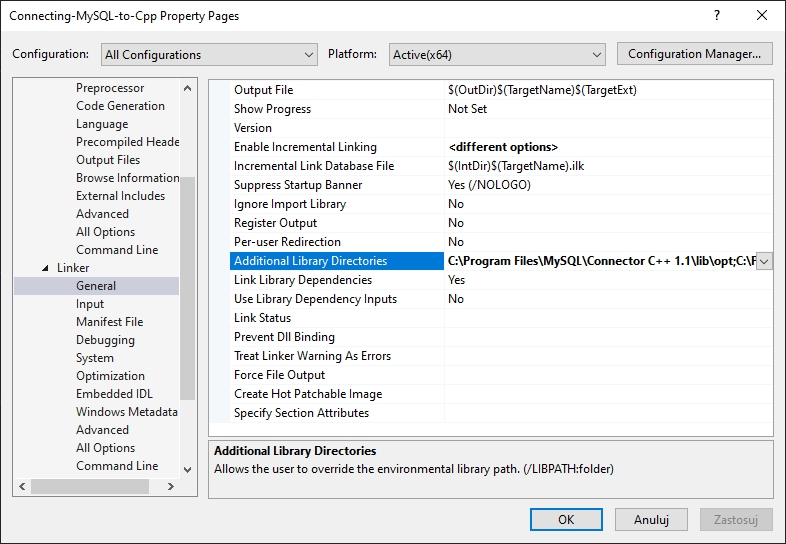

# Connecting MySQL database to C++ using Visual Studio 2019

## Downloading, installing and setting up MySQL

1. Download and install [MySQL installer](https://dev.mysql.com/downloads/windows/installer/8.0.html)
2. Using MySQL installer install `MySQL Community Server 8.0.X` and `MySQL Connector /C++ 1.1.13`
3. Create database using this template
```
    CREATE DATABASE tutorial;
    USE tutorial;
    CREATE TABLE test (id int, name varchar(32), score int);
    INSERT INTO test (id, name, score) VALUES (1, "Szymon", 99);
    INSERT INTO test (id, name, score) VALUES (2, "Tomek", 50);
    INSERT INTO test (id, name, score) VALUES (3, "Mateusz", 78);
    SELECT * FROM test;
```

## Setting up Visual Studio

1. Create new console app project
2. Change Solution Configuration to `Release` and Solution platform to `x64`
3. Right click to your project section and select properties

4. Go to `C/C++` section and select `General`

5. Select Additional Include Directories and add this directories `C:\Program Files\MySQL\Connector C++ 1.1\include`, `C:\Program Files\MySQL\MySQL Server 8.0\include`
6. Go to `Linker` section and select `General`

7. Select Additional Library Directories and add this directories `C:\Program Files\MySQL\Connector C++ 1.1\lib\opt`, `C:\Program Files\MySQL\MySQL Server 8.0\lib`
8. Move to `Input` in `Linker` section

9.  Select Additional Dependencies and add this libraries `mysqlcppconn.lib`, `libmysql.lib`

## Coding and building app

1. Code your app and build
2. After building go to directory with your executable file and paste there this DLLs
    - `libmysql.dll` from `C:\Program Files\MySQL\MySQL Server 8.0\lib`
    - `libcrypto-1_1-x64.dll` and `libssl-1_1-x64.dll` from `C:\Program Files\MySQL\MySQL Server 8.0\bin`
3. Run your app and enjoy :-)


I am not the author of this solution, I have corrected as well as shared in text version a 2018 tutorial found on [Youtube](https://youtu.be/yNniOHn9Xe0)